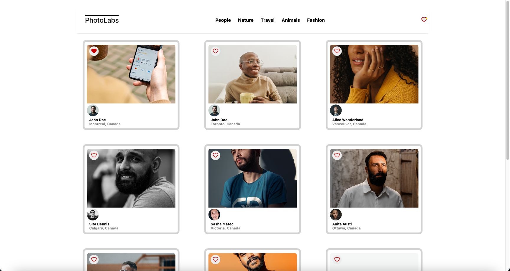
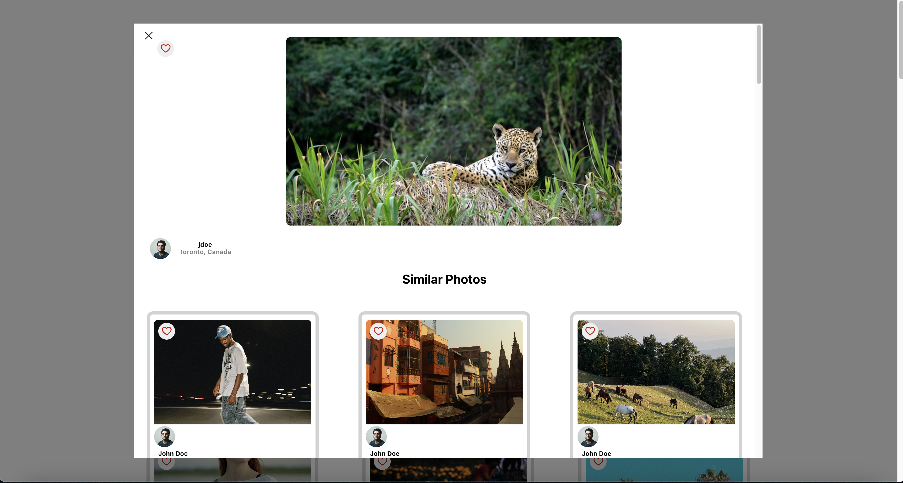

# Photolabs

PhotoLabs is a React-based single-page application (SPA) designed to provide users with an interactive photo viewing experience. Leveraging a pre-existing API, the app allows users to explore photos across various categories, view enlarged images with related photos, and mark favorites. The project combines client-side React development with a Node.js/Express backend and a PostgreSQL database.


# Key Features
- View photos from the homepage.
- Navigate through different photo categories (topics).
- View enlarged photos with related images.
- Like photos and see notifications for favorites.
- Integration with a backend API using Express and PostgreSQL.

# Technical Stack:

- React, Create React App, Webpack, Babel, Express

## Setup

Install dependencies with `npm install` in each respective `/frontend` and `/backend`.

## [Frontend] Running Webpack Development Server

```sh
cd frontend
npm start
```

## [Backend] Running Backend Servier

Read `backend/readme` for further setup details.

```sh
cd backend
npm start
```

##  Screenshots





